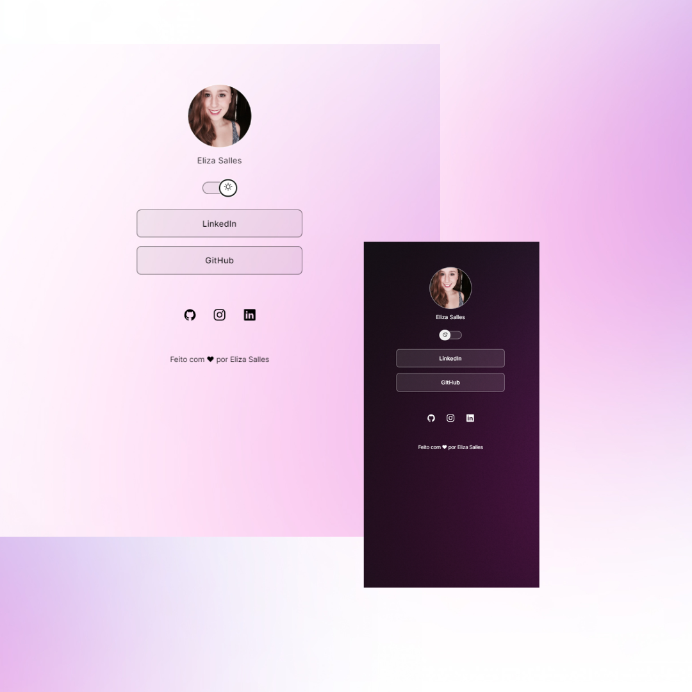

<h1 align="center"> Projeto Perfil </h1>

Projeto criado através da plataforma de estudos Rocketseat.  

 

  

  

## 🚀 Tecnologias

Esse projeto foi desenvolvido com as seguintes tecnologias:

- HTML e CSS
- JavaScript
- Git e Github
- Figma

 

## 💻 Projeto

O Projeto Perfil é um agregador de links para usar como cartão de visitas online.

- [Acesse o projeto finalizado, online](https://github.com/elizamsalles/projeto)

 

## 🔖 Layout

O layout do projeto foi criado pela Rocketseat e você pode visualizar através [DESSE LINK](https://www.figma.com/community/file/1187422022288947321). É necessário ter conta no [Figma](https://figma.com) para acessá-lo.

 

## :memo: Licença

Esse projeto está sob a licença MIT.

---

Feito com ♥ por mim e com o apoio da Rocketseat 